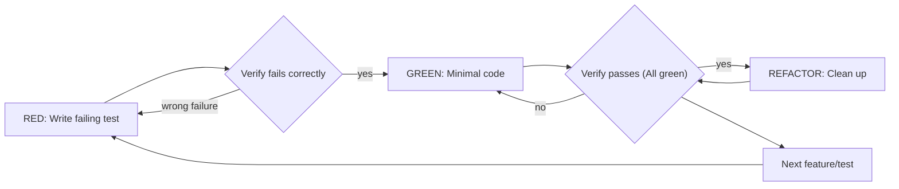

# Test-Driven Development (TDD)

## Overview

Write the test first. Watch it fail. Write minimal code to pass.

**Core principle:** If you didn't watch the test fail, you don't know if it tests the right thing.

**Violating the letter of the rules is violating the spirit of the rules.**

## When to Use

**Always:**
- New features
- Bug fixes
- Refactoring
- Behavior changes

**Exceptions (ask your human partner):**
- Throwaway prototypes
- Generated code
- Configuration files

Thinking "skip TDD just this once"? Stop. That's rationalization.

## The Iron Law

```
NO PRODUCTION CODE WITHOUT A FAILING TEST FIRST
```

Write code before the test? Delete it. Start over.

**No exceptions:**
- Don't keep it as "reference"
- Don't "adapt" it while writing tests
- Don't look at it
- Delete means delete

Implement fresh from tests. Period.

## Red-Green-Refactor



### RED - Write Failing Test

Write one minimal test showing what should happen.

**Good:**
```python
@pytest.mark.asyncio
async def test_create_user_with_invalid_email(client):
    response = await client.post(
        "/auth/register",
        json={"email": "invalid@yahoo.com", "password": "password123"}
    )
    assert response.status_code == 422
```
*Clear name, tests real behavior, one thing.*

**Bad:**
```python
def test_all_user_routes(client):
    # Tests login, register, delete all in one test with mocks
    ...
```
*Vague name, tests multiple unrelated things.*

**Requirements:**
- One behavior
- Clear name
- Real code (no mocks unless unavoidable)

### Verify RED - Watch It Fail

**MANDATORY. Never skip.**

```bash
uv run pytest test/path/to/test.py
```

Confirm:
- Test fails (not errors due to typos)
- Failure message is expected
- Fails because feature/assertion is missing

**Test passes?** You're testing existing behavior. Fix test.
**Test errors?** Fix error, re-run until it fails cleanly.

### GREEN - Minimal Code

Write the simplest code to pass the test.

Don't add extra speculative features, refactor unrelated code, or "improve" beyond what the test demands (YAGNI).

### Verify GREEN - Watch It Pass

**MANDATORY.**

```bash
uv run pytest test/path/to/test.py
```

Confirm:
- Test passes
- Other test suite still passes
- Output is pristine (no errors or warnings)

### REFACTOR - Clean Up

After green only:
- Remove duplication
- Improve variable and function names
- Extract helpers

Keep tests green. Don't add new behavior during refactoring.

### Repeat

Next failing test for next feature.

## Good Tests

| Quality | Good | Bad |
|---|---|---|
| Focused | Tests one specific behavior or condition | Tests multiple behaviors at once |
| Clear | Explains the expected behavior in test name | Generic or vague test names |
| Isolated | Runs independently without depending on other tests | Relies on execution order or shared state |
| Fast | Runs in milliseconds | Slow due to unnecessary external network calls |
| Deterministic | Always passes or fails reliably | Flaky or timing-dependent |
